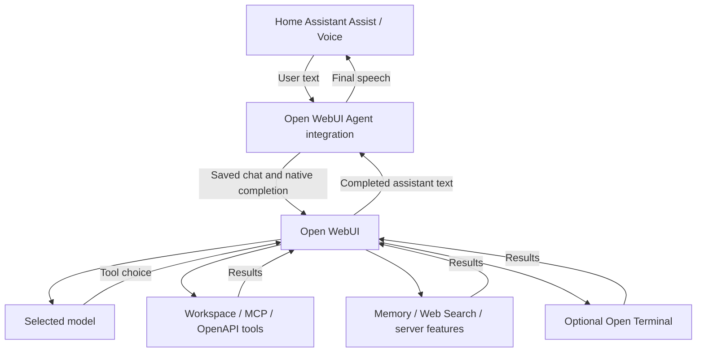

# Open WebUI Agent

**Home Assistant is the frontend. Open WebUI is the agent.**

A HACS custom conversation integration that sends Assist text to a real Open WebUI chat and waits for Open WebUI to finish its native server-side agent loop. Open WebUI chooses tools, executes them, processes their results, and produces the final response for Assist/TTS.

**Status: 2.0.0-beta.1, local testing candidate.** Automated protocol tests do not prove your model or tool configuration works. No live Open WebUI instance was available during development; complete the [acceptance tests](docs/testing.md) before relying on this integration for home control. This is an independent community project, not an official Home Assistant or Open WebUI integration.

## Why this exists

A plain completion request can return an unexecuted tool call. This integration uses Open WebUI's documented saved-chat native agent flow: create a linked message tree, submit a streaming completion with chat/message/session IDs, poll tasks, and retrieve the finished assistant message. It never interprets model output as a Home Assistant service call.



## Features

- Dynamically discovered base and Workspace/clone models, shown by friendly name.
- Real Open WebUI chats, stable sessions and linked multi-turn messages.
- Server-side Workspace, MCP and OpenAPI tool discovery and selection.
- Model tool defaults or a custom tool selection, without an OpenAI `tools` field.
- Separate Memory, Web Search, Code Interpreter and Image Generation flags.
- Optional discovered terminal or the selected model's default terminal.
- Async completion polling, separate request/completion timeouts, translated errors and sanitized diagnostics.
- Final-text Markdown stripping for voice; original chat content remains in Open WebUI.

These are implemented API paths, not a claim that every server feature has been tested end to end.

## Requirements

- Home Assistant **2026.6.0 or newer**. The old development configuration already pinned this version; the fork now makes that minimum explicit and uses its supported conversation lifecycle.
- An Open WebUI instance reachable from Home Assistant, an enabled API key, and permission to use the required endpoints.
- A model/provider that supports **Native function calling**, with streaming enabled. Clear a model's `Stream Chat Response = false` override.
- Current Open WebUI APIs described in [Server-Side Tool Calling](https://docs.openwebui.com/reference/server-side-tool-calling/). The source inspected identifies itself as **0.11.4**; see the [exact revision and compatibility assessment](docs/api-research.md). No numeric minimum or live-tested Open WebUI range has been established. A matching version number alone is not proof of compatibility.

## Configure Open WebUI first

1. Enable API keys and create a key for the user whose permissions the agent should have.
2. Select or create a Workspace model. Configure its provider, system prompt, Native function calling and permitted built-in capabilities in Open WebUI.
3. Attach any Workspace tools, MCP or OpenAPI servers to that model, or plan to select them explicitly in Home Assistant.
4. Verify the exact prompt and tool setup works in Open WebUI's browser as the same user.
5. For OAuth-protected MCP, complete authorization in that user's browser first.

Do not paste credentials into issue reports. If endpoint access is restricted, allow the endpoints in [API research](docs/api-research.md).

## Install with HACS

The fork URL was verified from this repository's Git remote:
[**bpepino/ha-openwebui-agent**](https://github.com/bpepino/ha-openwebui-agent).

1. In HACS, open the three-dot menu → **Custom repositories**.
2. Add `https://github.com/bpepino/ha-openwebui-agent`, category **Integration**.
3. Find **Open WebUI Agent**, download, and restart Home Assistant.
4. Open **Settings → Devices & services → Add integration → Open WebUI Agent**.

These steps require the maintainer to push this implementation first. This work does not publish it or submit it to the default HACS catalog. HACS is configured to install the integration directory from repository source, without requiring a release ZIP.

## Manual installation

Copy `custom_components/openwebui_conversation` into your Home Assistant configuration's `custom_components` directory and restart. Add **Open WebUI Agent** through Devices & services. Keep that directory name: it is the internal domain used by existing installations.

## Home Assistant setup and options

1. **Connection:** instance name, Open WebUI URL, API key, SSL verification and request timeout. Setup validates the key by listing models.
2. **Model and features:** choose a discovered model, feature flags, Markdown stripping and timeouts.
3. **Tools:** choose model defaults or custom selection. The multi-select applies only to custom mode.
4. **Terminal:** none, model default or a specific discovered server.
5. Select the conversation entity in your Assist pipeline under **Settings → Voice assistants**. To test that Open WebUI performs home control, disable **Prefer handling commands locally** for that pipeline.

Open the integration's **Configure** action to refresh models, tools and terminals and edit options. If a resource temporarily disappears, its saved ID remains selectable and the form warns you. A missing model or explicitly selected tool fails clearly at runtime; it is never silently replaced with a different model/tool. An expired API key triggers Home Assistant's reauthentication flow.

| Setting | New-install default | Meaning |
| --- | --- | --- |
| Memory | On | Request Open WebUI memory tools, subject to permissions/capabilities |
| Web Search | On | Let the native agent decide whether to search |
| Code Interpreter | Off | Experimental; use a server engine such as Jupyter |
| Image Generation | Off | Open WebUI may create images; Assist receives text only |
| Tool mode | Model defaults | Read `info.meta.toolIds` and send exact accessible IDs |
| Terminal | None | Explicitly opt into model-default or selected terminal access |
| Request timeout | 30 seconds | Maximum time for one HTTP request |
| Completion timeout | 120 seconds | Saved-chat creation/update, submission and completion wait |
| Poll interval | 2 seconds | Delay between active-task checks |
| Strip Markdown | On | Clean only the final spoken text |

Model/resource discovery happens before the completion deadline and is bounded by individual request timeouts.

## Models, tools and terminals

Models come from `/api/models`, including Workspace clones and base models. Model/provider settings remain on Open WebUI. The integration requests native function calling and streaming; a detected model setting forcing legacy mode or disabling streaming is rejected.

The inspected server returns accessible Workspace, MCP and server-side OpenAPI resources together from `/api/v1/tools/`. IDs such as `server:mcp:...` are preserved exactly. Browser-local `direct_server:` connections are not supported: configure a server-side connection in Open WebUI instead.

**Use model defaults** reads the same `info.meta.toolIds` field used by Open WebUI's browser and explicitly sends those IDs. It does not assume the backend inherits them. Missing access or unfinished OAuth causes an actionable error, whereas the browser may offer an OAuth dialog. User-browser saved selections are not imported.

Custom mode sends the selected IDs. An empty selection means no external tools; built-in feature flags and backend-managed model knowledge remain independent. There is no model-specific function name in the integration.

**Use model default terminal** reads `info.meta.terminalId` and explicitly sends `terminal_id`. Terminal discovery excludes `contexts.chat: false`; chat-scoped terminals receive the real saved chat ID. The model's terminal capability must permit access.

## Built-in features

### Web Search

Configure a search engine and user/model permissions in Open WebUI, then enable Web Search here. Ask a natural question needing current information. There are no required trigger phrases and no Home Assistant search implementation.

### Memory

This is **Open WebUI Memory**, scoped by the API-key user. Enabling the flag requests access; it does not guarantee the model will save or recall every fact. Use the [memory acceptance test](docs/testing.md) and inspect Open WebUI's memory UI.

### Code, images and other capabilities

Code Interpreter's browser Pyodide engine requires a real browser connection and will not work through this HTTP client. Use Jupyter/server execution and test your setup. A generated session UUID enables documented server-side built-ins; it is not a connected WebSocket client.

Open WebUI remains responsible for knowledge and other built-ins it offers under its permissions/model settings. This integration does not implement separate Notes, Calendar, Automations, Tasks or sub-agent APIs, and these capabilities have not been live-tested here. It does not upload files, attach knowledge collections, import browser-selected skills/filters, render images or interactive artifacts, or answer browser confirmation dialogs. Model-attached knowledge remains subject to Open WebUI's backend behavior. Structured output and citations remain in the saved chat; source JSON is never spoken. A response containing only non-text output returns an error directing you to that chat.

## Control Home Assistant through Open WebUI

Configure a Home Assistant MCP/OpenAPI/Workspace tool **inside Open WebUI**, with suitable permissions:

`Assist → Open WebUI Agent → Open WebUI → Home Assistant MCP/tool → Home Assistant`

This integration does not expose Home Assistant entities as LLM tools, register a Home Assistant LLM API, or execute function calls. Only Open WebUI runs the agent loop. Test a device action in Open WebUI first, then follow the same-user/model test in [manual acceptance](docs/testing.md).

## Multi-turn conversations and chat visibility

Each Home Assistant conversation ID maps to its own saved chat and session. Follow-ups append linked user/assistant nodes, reuse that chat, and send the active branch with structured assistant output where present. Concurrent turns in one HA conversation are serialized; different conversations stay isolated.

Chats are titled **Home Assistant**. Title, tag and follow-up generation are disabled to avoid extra model calls. Chat history is not automatically deleted.

Mappings are in memory, limited to 128 idle conversation references per entry. Reload, restart, model changes, old-map eviction, or a failed/uncertain run starts a fresh chat on the next turn. Open WebUI chat history remains intact. A manually deleted chat is recovered once by creating a new one. Changes made manually in the browser while a mapped Assist conversation is active are not synchronized as a new conversation branch; avoid simultaneous editing.

## Voice / Assist

Only the final assistant prose is returned. Structured reasoning and tool events are excluded, with the last assistant message used after tool rounds. Strip Markdown affects TTS only. Agent requests can take longer than a voice pipeline's own limit; increasing this integration's timeout does not change the pipeline's timeout.

## Debugging and diagnostics

Enable integration logging with:

```yaml
logger:
  default: warning
  logs:
    custom_components.openwebui_conversation: debug
```

Logs include versions, shortened chat IDs, model IDs, feature flags, tool counts, polling progress, HTTP failure status and duration. They do not include prompts, histories, response bodies, tool arguments or API keys. Diagnostics use an allowlist of versions, flags, modes, timeouts and counts; URLs and resource identifiers are omitted. Review even sanitized logs before sharing because model IDs can be personal.

## Troubleshooting

| Symptom | Checks |
| --- | --- |
| Unexecuted `<tool_call>` | Native mode, streaming, model capability, tool assignment, same-user browser test and Open WebUI logs. The integration rejects raw calls; it never executes them. |
| Model missing | `/api/models`, API-key user permissions and model visibility. Open Configure to refresh. |
| Tools missing | Server-side configuration, user access, `/api/v1/tools/` and OAuth authorization. Browser-local tools are unsupported. |
| Listed tool does not run | Confirm the same prompt works in Open WebUI. Discovery does not guarantee execution or model selection. |
| Web Search or Memory unused | Global settings, user permissions, model built-in categories and integration toggles must all allow the feature. |
| Code says WebSocket required | Replace browser Pyodide with server-side Jupyter, or disable Code Interpreter. |
| No final text / task error | Inspect the saved chat; a server task may fail, require a browser interaction, or return only media. |
| Timeout | Increase the completion timeout and inspect the saved chat before retrying. An accepted server action may still finish. |
| 401 / 403 | API key validity, global API-key enablement, user permissions and API endpoint restrictions. |
| SSL error | Use a trusted certificate accessible to HA. Disable verification only if you deliberately accept that tradeoff. |
| Task/chat API unavailable | Upgrade or check reverse-proxy routes against the documented native API. No legacy fallback is used. |

Cancellation/unload stops local waiting. It does not guarantee cancellation of server work. The integration deliberately avoids automatic completion retries, which could repeat a real-world action.

## Security

See [SECURITY.md](SECURITY.md). The key acts with its Open WebUI user's authority. Use least privilege and HTTPS across untrusted networks. Tools and terminals can perform real actions; access control stays on Open WebUI and its tool servers.

## Updating and migration

Back up Home Assistant before replacing the upstream integration. Remove the upstream HACS repository entry if necessary to prevent two repositories managing the same folder; do not delete your HA config entry. Install this fork over the same component folder and restart.

Config-entry migration keeps the `openwebui_conversation` domain, credentials, title/entity identity, URL, model, request timeout, SSL and Markdown settings. Legacy search enablement becomes native Web Search. Old trigger sentences, result prefixes and language settings are retained in options but are inactive. A previously omitted model is not replaced with a guessed ID: select a discovered model in Configure. This fork requires HA 2026.6.0+, so upgrade HA before installing on older systems.

## Uninstalling

Remove the integration in Devices & services, then remove it from HACS (or remove its component folder) and restart. Revoke the API key if no longer needed. Saved Open WebUI chats and memories are not deleted automatically; manage them in Open WebUI.

## Development and contributing

See [development](docs/development.md), [API research](docs/api-research.md), [acceptance tests](docs/testing.md), [changelog](CHANGELOG.md) and [contributing](CONTRIBUTING.md). Report your HA/Open WebUI/integration versions and whether the same setup works in Open WebUI's browser. Never post API keys or tokens.

## Upstream and license

Open WebUI Agent for Home Assistant was originally forked from [TheRealPSV/ha-openwebui-conversation](https://github.com/TheRealPSV/ha-openwebui-conversation) and has been expanded to use Open WebUI's full server-side agent architecture. The upstream integration was based on [ej52/hass-ollama-conversation](https://github.com/ej52/hass-ollama-conversation/).

The original [AGPL-3.0 license](LICENSE) is preserved unchanged. The [Fu-Jie client assessment](docs/api-research.md#existing-python-client-assessment) documents a researched alternative; it is not bundled or used as a dependency.
